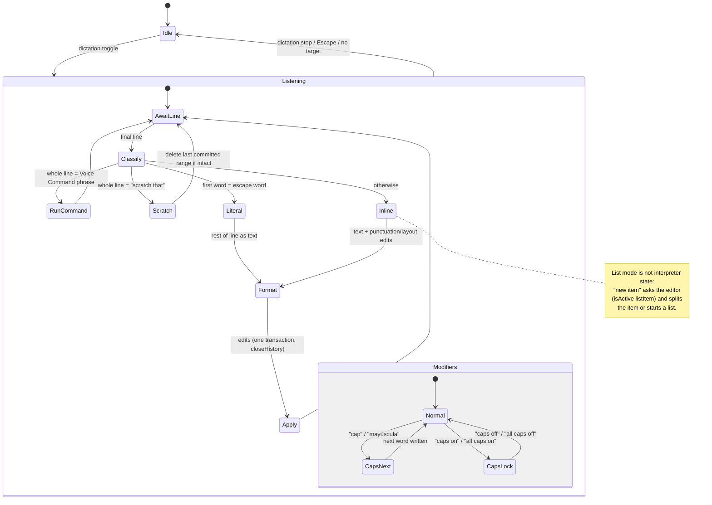

# A Dictation Command Interpreter for Maibuk (Moonshine + TipTap 3 + Tauri 2)

Research date: 2026-09-28. Primary sources only: vendor help pages, specs, and source code pinned to a commit or tag. Every code citation gives the repository, ref, file, and line. Maibuk paths are relative to the repo root at `f5a098b` (origin/main, after #258 and #260). Section 2.4 is a small probe I ran against the Dictation Models installed on this machine; everything else is read, not run.

Pinned refs used below:

| Source | Ref |
| --- | --- |
| Moonshine Voice (`moonshine-ai/moonshine`) | tag `v0.1.5` = commit `234f60faa0eb388b01cdf7e60aca232af37aefda` |
| `moonshine-voice` (PyPI, probe only) | `0.1.5` |
| Talon community command set (`talonhub/community`) | commit `dafe1dccb02e61b27dea8afe5e6d846e76d19c1e` (main, 2026-09-26) |
| annyang (`TalAter/annyang`) | commit `c31928ac9ae13df13fc7a370530065ea5a7502c1`; npm `3.0.0` |
| Vosk (`alphacep/vosk-api`) | tag `v0.3.50` |
| TipTap | `3.15.1` (installed `@tiptap/core`, `@tiptap/extension-list`, `@tiptap/extension-hard-break`) |
| Piper TTS (probe only) | PyPI `piper-tts` `1.8.0`, voices `en_US-lessac-medium`, `es_ES-davefx-medium` from `rhasspy/piper-voices` |
| W3C SRGS 1.0 | Recommendation, 16 March 2004 |
| JSGF | W3C Note, 5 June 2000 |

---

## Summary and recommendation

**Write a small, hand-written, pure TypeScript interpreter; do not adopt a library or a second model.** It sits exactly where `router.ts` already reserves the seam, runs only on finished lines, and turns each line into a list of edits (text, punctuation, paragraph, line break, list steps) or one Command. Everything it does is same-input-same-output and belongs in unit tests with fixture transcripts.

1. **Two kinds of phrase, two matching rules.** Punctuation and layout phrases ("comma", "new paragraph", "coma", "nuevo párrafo") match anywhere inside a line, longest match first, like Apple Dictation, Google Docs, Gboard, and Windows voice access do (section 1). Voice Commands that run a registry Command ("make that bold") match only when they are the whole line, the way Dragon uses pauses and Talon uses `^...$` anchors (sections 1.4, 1.6). Moonshine already ends a line at a pause (section 2.3), so "say it on its own" is the natural user rule, and it removes most false triggers from prose.
2. **Normalize before matching, keep the surface for inserting.** Fold case, strip diacritics, and split off the model's own punctuation. The probe shows why: the English model writes spoken "comma" as the word plus its own punctuation ("Hello, comma, how are you question mark?"), the Spanish Small model sometimes adds a final period and capitals on an isolated line ("Nuevo Palafox."), and the Spanish Tiny model once produced full `¡...!` and `¿...?` even though the catalog says it has no punctuation (section 2.4).
3. **An escape word, and "scratch that".** Every mature product has a literal escape: Windows Speech Recognition "literal comma", voice access "Type <command>", Talon `^escape <text>$` (sections 1.3, 1.5, 1.6). Every one also has "scratch that" for the last dictated span (Dragon, voice access, Talon). Implement "scratch that" as removal of the last committed range mapped through later transactions, not as Undo, so it never removes the author's own typing.
4. **Capitalization and spacing live in the interpreter, per language.** Spanish models return lowercase text with no punctuation (catalog `capabilities`, `src/features/dictation/catalog.json`; spike results in `docs/research/voice-dictation.md`). Port Talon's "capitalization charge" and `needs_space_between` ideas (section 3.4), and add Spanish opening marks `¿`/`¡`, which neither Apple's nor Microsoft's Spanish command lists offer (section 1.8).
5. **Phrases are bindings of Commands, stored like Custom Shortcuts.** Extend ADR 0012's device-local layer with a per-language phrase list per Command, defaults in a registry-side data file keyed by Dictation language (not by UI locale), a `voice` flag on the Commands that may take phrases, and conflict detection on normalized phrases. Punctuation and layout phrases become Commands in a new "Dictation" section so one editor, one file format, and one conflict check cover everything (section 4).
6. **v1 dispatches only Commands that need no KeyboardEvent.** Registry handlers today receive the `KeyboardEvent` and some read `event.key`, `event.code`, or `event.target` (`src/pages/Home.tsx:136-190`). Editor Commands already have event-free runners in `EDITOR_COMMANDS` (`src/components/editor/editor-commands.ts:33-65`). Start with those plus Dictation's own Commands; app-level Commands need an explicit voice entry point and come later.
7. **Change the `DictationTarget` contract, not `RecognizerHost`.** `commit(text)` becomes `apply(edits)` in one ProseMirror transaction with `closeHistory`, so one spoken line stays one undo step. The `RecognizerHost` protocol (ADR 0013) is untouched in v1; word timestamps (section 2.5) would change it and need their own ADR.
8. **Two ADRs.** One for "phrases are a second binding kind in the Custom Shortcuts layer, keyed by Dictation language" (extends ADR 0012), one for "the interpreter is deterministic text rules over finished lines; no grammar-constrained decoding and no intent model" (the trade-off in section 3). `CONTEXT.md` moves Voice Command and Dictation Command Interpreter out of Anticipated and gains a term for the phrase itself.

**Top risks:** recognition of short command phrases is poor in the probe, but the probe used a synthetic voice and Andy's own dictation in both languages has been accurate, so the misses most likely reflect the TTS assets (section 2.4); English prose words that are also punctuation words ("period", "colon") need the whole-line rule or the escape; authors will want alias phrases for consistent mishearings.

---

## Decisions (2026-09-28)

Settled with Andy after this research. Where they differ from the recommendations above, the decisions win; sections 5.3 to 5.5 describe the rejected "punctuation as Commands" design and are kept as the record of why. Glossary: `CONTEXT.md` (Dictation Language, Dictation Command Interpreter, Spoken Punctuation, Voice Command, Dictation Vocabulary). ADRs: 0014 and 0015.

**Two layers, not one.** Voice Commands are a second way to run registry Commands, next to Shortcuts. Spoken Punctuation (punctuation, paragraph, line, list item, `cap`/`mayúscula <word>`, the escape word "literal", "scratch that"/"borra eso") is Dictation configuration, not Commands: listed in Settings → Dictation, each entry switchable off and open to custom aliases per Dictation Language. No Shortcuts for Spoken Punctuation.

**v1 scope.**

1. The Interpreter: deterministic, pure TypeScript, model-agnostic, finished lines only (ADR 0015).
2. Spoken Punctuation, matched anywhere in a line, longest match first. On by default where the model does not punctuate (capability flag, not language name); layout phrases always on.
3. Spanish `¿`/`¡`: explicit "abre interrogación/exclamación"; closing a question or exclamation with no opener inserts the opener at the start of that sentence.
4. Voice Commands, editor tier only (`EDITOR_COMMANDS`): phrases are verb × target from a per-language vocabulary with on/off polarity and ignored filler words; whole line, two words minimum; Command semantics (selection, else what is dictated next); custom phrases typed in the Shortcut Editor's Voice list, stored in the ADR 0012 layer v2 and the Shortcut File; conflicts with Spoken Punctuation refused; each run announced in a live region.
5. Dictation Vocabulary: heard form → written form per Dictation Language, device-local, applied first, output is literal text. Moonshine context biasing is not in v1.
6. "Scratch that" removes dictated text back to the previous sentence end, up to 10 sentences, never the author's typing; with no sentence ends it removes the last dictated line; a sentence begun by hand loses only its dictated tail.
7. Trace: interpreter time per line, Voice Command hits, Spoken Punctuation hits, and scratch-that uses join the memory-only line stats in Settings → Dictation.
8. Performance: under 1 ms p99 per line with 1,000 aliases and Vocabulary entries; phrase table rebuild under 10 ms; periodic `vitest bench` on desktop and Android; the gate lane asserts the algorithm, not timings.
9. Ship gate: human-recorded command WAVs in the conformance lane, at least 80% hit rate on default phrases with the Accurate model, zero triggers on a prose set.

**Voice Command vocabulary** (checked against the Microsoft voice access and Google Docs pages; Apple publishes no command list — see the verification log). The rows below correct the draft where the pages disagree; phrasing the pages do not document is Maibuk's own, kept short and distinct on purpose:

| Class | en | es | Targets |
| --- | --- | --- | --- |
| Format on | make, set, turn on, use, apply | poner, activar, usar, aplicar | bold, italic, underline, strike, code |
| Format off | remove, turn off | quitar, desactivar | same |
| Block to | make, turn into, change to, apply | convertir en, cambiar a, poner | heading one to three, quote |
| List | start, begin, create, end, stop | empezar, iniciar, crear, terminar, salir de | bullet list, numbered list |
| Align | align, center | alinear, centrar | left, center, right, justify |
| Action | undo, redo | deshacer, rehacer | that / eso |
| Dictation | stop | parar, detener | dictation / dictado |

Filler words: en "the, to, in, a"; es "la, el, las, los, en, a, al". Targets accept number and gender variants, and numbers as words or digits ("heading 1" / "título uno"). "stop" left Format off because both vendors use it to stop listening ("stop dictation" keeps it, on a different target), and "remove" is Google Docs' unset verb ("Remove bold"); "create … list" and "apply heading …" come from Google Docs, "poner en negrita" and "deshacer eso" from voice access in Spanish. Paragraph is not a v1 target: no Command with an event-free runner changes a block to a paragraph today.

**Next, not deferred:** a Tutorial "Dictation" section that teaches without dictating: steps anchored on Settings → Dictation and the Shortcut Editor's Voice list, plus an `image` step for the editor control, covering every Dictation term.

**Deferred, each with its own issue:** app-tier Voice Commands; "<target> that" on the last dictated span; custom verbs and targets; recording a Voice Command by dictating it (v2, typing stays); an all-caps lock; "numeral"; word timestamps and a pause rule inside a line; Moonshine context biasing for Vocabulary words, kept only if measured faster than the Interpreter's replacement.

---

## 1. Prior art: how dictation products handle spoken commands

### 1.1 Apple Dictation (macOS) and Voice Control

- **Dictation command table, English.** Punctuation words include "comma", "colon", "semicolon", "period/point/dot/full stop", "question mark", "exclamation mark", "quote"/"end quote", brackets; layout words "new line" ("Starts a new line.") and "new paragraph" ("Starts a new paragraph."); formatting "numeral", "roman numeral", "no space on"/"no space off", "tab key"; case "caps on" ("Formats the next phrase in Title Case."), "caps off", "all caps" ("Formats the next word in ALL CAPS."), "all caps on"/"all caps off" ([Commands for dictating text on Mac](https://support.apple.com/guide/mac-help/commands-for-dictating-text-mh40695/mac), table rows extracted from the page HTML).
- **Same table, Spanish (es-ES).** "coma" → `,`, "dos puntos" → `:`, "punto y coma" → `;`, "punto" → `.`, "signo de interrogación" → `?`, "signo de exclamación" → `!`, "nueva línea", "nuevo párrafo", "sin espacio activado"/"desactivado", "mayúsculas activadas"/"desactivadas", "todo en mayúsculas" ([es-es page](https://support.apple.com/es-es/guide/mac-help/mh40695/mac)). **There is no row for `¿` or `¡`.** The Spanish table maps "signo de interrogación" to `?` only.
- **Voice Control modes.** "Dictation mode ... Any words you say that aren't Voice Control commands are entered as text"; "Command mode ... Voice Control responds only to commands. Words and characters that aren't commands are ignored"; "Spelling mode ... Dictate character by character" ([Use Voice Control commands](https://support.apple.com/guide/mac-help/use-voice-control-commands-mh40719/mac)).
- **Custom commands.** A "When I say" phrase, a scope ("any app or ... a specific app"), and an action: "Press Keyboard Shortcut", "Paste Text", or "Run Shortcut". Apple advises names of "two or more words", e.g. "Make text smaller" instead of "Smaller". Built-in commands can be turned off one by one ([Customize Voice Control on Mac](https://support.apple.com/en-ca/guide/mac-help/mchl9899c8a5/mac)). This is the closest analog to "assign a voice phrase to any Command": a phrase is bound to a keyboard shortcut, scoped by app.
- **Apple publishes no formatting command list.** The Voice Control page fetched for issue #282 gives examples only ("Delete", "Uppercase", "Show commands") and points to the in-app Commands window; the macOS Dictation command table (already extracted in pass 2) has no bold, italic, or underline row. Apple cannot be a written source for the default verb list.

### 1.2 Google Docs voice typing and Gboard

- **Docs.** Punctuation: "Period", "Comma", "Exclamation point", "Question mark", "New line", "New paragraph". Caveat verbatim: "Punctuation might not be available in every language: Voice commands are available only in English. The account language and document language must both be English." List commands: "Create bulleted list", "Create numbered list", "Insert bullet", "Insert number". Stop: "Stop listening." Formatting commands, all English only: "Bold", "Italicize"/"Italics", "Underline", "Strikethrough", "Subscript", "Superscript", "Apply heading [1–6]", "Apply normal text", "Remove bold", "Remove italics", "Remove strikethrough", and alignment as "Align center"/"Align justified"/"Align left"/"Align right" (also "Center align", "Left align", "Right align"). "Undo" appears in the troubleshooting text. ([Type & edit with your voice](https://support.google.com/docs/answer/4492226?hl=en)). The page lists many Spanish locales for dictation itself, but editing commands are English only.
- **Gboard (Android).** Same six punctuation words; "Punctuation might not be available in all languages" ([Type with your voice](https://support.google.com/gboard/answer/2781851?hl=en&co=GENIE.Platform%3DAndroid)). Advanced voice typing (Pixel 6+) adds "Delete last word", "Clear", "Clear all", "Undo", and on Pixel 8+ "Delete ___", with this rule verbatim: "try saying these commands or similar commands after a brief pause (at least half a second), while ensuring that the cursor isn't located too far (more than one or two sentences) away from the words you want to edit". Advanced voice typing supports "English, French, German, Italian, Japanese, and Spanish" ([Use advanced voice typing features](https://support.google.com/gboard/answer/11197787)).

Takeaway: Google treats punctuation as inline words and editing commands as pause-delimited utterances.

### 1.3 Windows voice access and Windows Speech Recognition

- **Voice access modes.** "Commands mode" (commands only), "Dictation mode" (dictation only), and "Default mode" ("comando y dictado", command and dictation) ([Voice access command list](https://support.microsoft.com/en-us/accessibility/windows/voice-access/voice-access-command-list); the Spanish page names the default mode explicitly: [es-es](https://support.microsoft.com/es-es/accessibility/windows/voice-access/voice-access-command-list)).
- **Literal escape.** "Insert a voice access command as text in a text box.": "Type <voice access command>" or "Dictate <voice access command>" (same page). Deletion: "Delete that", "Scratch that", "Strike that" delete "the selected text or last dictated text". "New paragraph" inserts a paragraph and places the cursor at its start. Punctuation rows: `.` "Period" / "Full stop", `?` "Question mark".
- **Spanish voice access.** `?` "Signo de interrogación", `:` "Dos puntos", `;` "Punto y coma", `...` "Puntos suspensivos" / "Punto punto punto", "Nuevo párrafo". No opening `¿` row appears in the table rows I extracted from the es-es page. The Spanish page is visibly machine translated ("Rasca eso" for "Scratch that"), so treat it as evidence of coverage, not of good phrasing.
- **Formatting rows** (extracted from the en-us and es-es tables for issue #282). English applies a mark to the selection or last dictation with "that": "Bold \<text\>" / "Boldface \<text\>" / "Bold that", "Italicize \<text\>" / "Italicize that", "Underline \<text\>" / "Underline that". Spanish: "Poner en negrita eso", "Poner en cursiva eso", "Subrayar eso". Neither language has an unset-format row; Google Docs supplies those. Undo/redo: "Undo that", "Redo that"; Spanish "Deshacer eso", "Rehacer eso". Case: "Capitalize \<word\>", "Uppercase \<word\>"/"All caps \<word\>", "Lowercase \<word\>"/"No caps \<word\>".
- **Windows Speech Recognition (legacy).** "Literal **word**" "inserts the actual word instead of interpreting it (for example, "literal comma" inserts the text "comma")"; "Numeral **number**"; "Scratch that"/"Undo that"; "Caps **word**", "No caps **word**", "All caps **word**" ([Windows Speech Recognition commands](https://support.microsoft.com/en-us/accessibility/windows/voice-access/windows-speech-recognition-commands)).

### 1.4 Dragon (Nuance)

- **Pauses decide command vs dictation.** Verbatim: "Dragon uses pauses to determine whether a phrase should be considered a command or dictated text. For best recognition when issuing a command, speak the command smoothly and continuously, but pause before and after it." and "If you speak smoothly and continuously, Dragon will interpret your words as *dictation*, even if they include words that might be a command." Modes: Dictation (text and commands), Command ("If you say something that Dragon can't interpret as a command, nothing happens"), Spelling ("No automatic spacing or capitalization will be applied"), Numbers ([Recognition modes, Dragon for Mac](https://www.nuance.com/products/help/dragon/dragon-for-mac6/enx/Content/Introduction/RecognitionModes.html)).
- **Scratch that.** "Scratch that deletes the last utterance you dictated." ([Take it back](https://www.nuance.com/products/help/dragon/dragon-for-mac/enx/Content/Correction/TakeBack.htm)). The v16 cheat sheet lists "Scratch that <n> times", "Resume with <xyz>", "Correct that", "All caps on | off", "New line", "New paragraph", "Bullet selection" ([Command cheat sheet, Dragon Professional v16](https://dragon.nuance.com/shared/data-sheets/ct-dragon-professional-v16-and-legal-v16-command-cheat-sheet-en-us.pdf), text extracted with `pdftotext`).
- **Punctuation spacing.** "In Dictation mode, Dragon will insert intelligent spacing around punctuation." ([Dictating punctuation and symbols](https://www.nuance.com/products/help/dragon/dragon-for-mac/enx/Content/Dictating/Dictating_punctuation.htm)).
- **Unverified:** a Dragon "literal" command for punctuation words. None of the Nuance pages I read document one. Settle: the Dragon Professional v16 user guide index.

### 1.5 Talon Voice

- **Grammar.** A `.talon` file has a context header, a `-` line, then rules `spoken form: body`. Spoken forms support `[optional]`, `a | b`, `( )` grouping, `+`/`*` repetition, lists `{list}`, captures `<capture>`, and anchors: "`^` at the start of a command means the command must be the first command in an utterance. `$` at the end ... must be the last"; "Anchoring is sometimes useful for preventing command misrecognitions." Talon chains several commands in one utterance by default ([Talon Files](https://talonvoice.com/docs/reference/guide.language.html)).
- **Contexts and modes.** Header lines match `app`, `os`, `tag`, `mode` and more; "A Mode defines a set of commands users can chain together"; the built-in modes include `command`, `dictation`, `sleep` ([Define and override behavior](https://talonvoice.com/docs/reference/guide.extending.html)). This is the same shape as Maibuk's Shortcut Contexts.
- **Dictation mode in the community command set** ([`core/modes/dictation_mode.talon`](https://github.com/talonhub/community/blob/dafe1dccb02e61b27dea8afe5e6d846e76d19c1e/core/modes/dictation_mode.talon)): prose goes through `user.dictation_insert()` "to correctly auto-capitalize/auto-space" (L7-L8); `cap`, `no cap`, `no space` modify the next insert (L9-L12); `^cap that$` reformats the last phrase (L13); "nope that | scratch that: user.clear_last_phrase()" (L74); and the literal escape `^escape <user.text>$` under the comment "Escape, type things that would otherwise be commands" (L82-L83). Key presses (`^press <user.keys>$`, L4-L5), the reformat commands, and the escape are anchored at both ends; the navigation and punctuation-bearing prose rules are not.
- **Formatting code worth porting** ([`core/text/text_and_dictation.py`](https://github.com/talonhub/community/blob/dafe1dccb02e61b27dea8afe5e6d846e76d19c1e/core/text/text_and_dictation.py)): `no_space_after` / `no_space_before` regexes (L316-L337), `auto_capitalize()` with a "capitalization charge" that sentence ends and blank lines create and the next letter absorbs, with `e.g.`/`i.e.` exceptions (L371-L420), and `DictationFormat.update_context(before)` which re-derives state from the text before the cursor (L435-L443), read by `dictation_peek` (L583). Maibuk's `needsSpaceBefore` (`src/components/editor/extensions/Dictation.ts:14-19`) is the first half of this already.

### 1.6 Serenade

Serenade (`serenadeai/serenade`, 415 stars, last push 2024-06-11, not archived per `gh api`) is voice coding with a cloud speech engine and per-editor plugins (repo README). It is a code-editing grammar, not a prose dictation one; nothing in it maps onto punctuation or prose rules. Not pursued further.

### 1.7 Comparison

| Product | Punctuation words | Where commands may appear | Literal escape | Scratch that | Custom phrase → action | Spanish commands |
| --- | --- | --- | --- | --- | --- | --- |
| Apple Dictation / Voice Control | Yes | Inline (dictation); modes for command-only | Not documented | Not in the tables read | Yes, "When I say" → keyboard shortcut, per app | Yes, no `¿`/`¡` |
| Google Docs | Yes (6) | Inline | Not documented | No ("Delete last word") | No | Commands English only |
| Gboard advanced | Yes, plus auto punctuation | Editing commands after a pause ≥ 0.5 s | Not documented | "Undo", "Clear" | No | Yes (6 languages) |
| Windows voice access | Yes | Default mode mixes; Command / Dictation modes | "Type <command>" | "Scratch that" | Not in the list read | Yes, no `¿` row |
| Windows Speech Recognition | Yes | Mixed | "Literal <word>" | "Scratch that" | Not read | Not read |
| Dragon | Yes | Pause before and after a command | Unverified | "Scratch that <n> times" | Not read | Not read |
| Talon (community) | Yes (lists) | Chained; `^`/`$` anchors | `^escape <text>$` | "scratch that" | Yes, any `.talon` rule | Community set is English |

### 1.8 What the prior art settles for Maibuk

- Inline punctuation words are universal. Whole-utterance (pause-delimited) matching is the universal defense for commands that do things.
- A literal escape and "scratch that" are table stakes.
- Spanish support in shipped products stops at `?` and `!`. Nobody documents `¿`/`¡` openers, which the RAE requires (section 3.5). Maibuk has to design this itself.

---

## 2. What Moonshine actually emits

### 2.1 Partial vs final

`LineStarted` then `LineTextChanged`/`LineUpdated` until `LineCompleted`; "Once `LineCompleted` has been called, the library will never alter that line's text"; `stop()` completes any active line ([transcription.md L114-L128](https://github.com/moonshine-ai/moonshine/blob/v0.1.5/docs/using/transcription.md#L114-L128)). Maibuk maps these to `partial` and `final` events of `RecognizerHost` (`src/features/dictation/types.ts:72-76`), and the session routes only `final` text (`src/features/dictation/session.ts:114-131`). The interpreter therefore never sees partials, which is right: a partial "new para" must not act.

### 2.2 Casing and punctuation per model

The catalog declares English models `casing: true, punctuation: true` and Spanish models `false, false` (`src/features/dictation/catalog.json`; field documented as "What the model's text already has; the future interpreter reads this", `src/features/dictation/types.ts:29-30`). The spike measured Spanish output with no capitals and no punctuation (`docs/research/voice-dictation.md`, "Spike results"). Section 2.4 shows the flags describe the typical case, not a guarantee.

### 2.3 Where a line ends

A line is a VAD segment: Silero VAD (`core/voice-activity-detector.h`), `vad_threshold = 0.5`, `vad_window_duration = 0.5` s, `vad_max_segment_duration = 15.0` s ([`core/transcriber.h` L183-L187](https://github.com/moonshine-ai/moonshine/blob/v0.1.5/core/transcriber.h#L183-L187)). `LineCompleted` is "Sent when we detect that someone has paused speaking" (transcription.md L118). So a pause ends a line, and 15 s of speech without one is cut anyway. The exact minimum pause is not documented; in the probe a 0.3 s gap (plus Piper's own trailing silence) was already enough to split lines (section 2.4).

### 2.4 Probe: spoken commands through the installed models

What I ran: Piper TTS synthesized each phrase; the PyPI `moonshine-voice` 0.1.5 transcriber loaded the Maibuk-installed model directories (`moonshine-small-en-260821`, `moonshine-small-es-260824`, `moonshine-tiny-es-260824`) with `transcription_interval=0.2`, fed 100 ms chunks, and printed each `LineCompleted`. Two runs gave identical output. Scripts and raw output: `/tmp/claude-1000/probe/run.py`, `run2.py`, `run3.py`, `run1.out`, `run3.out` (scratch, not in the repo). **A synthetic voice is out of distribution for these models, so recognition accuracy here says little about a human author.** What it does show reliably is the shape of the text.

| Model | Said | Line(s) received |
| --- | --- | --- |
| small-en | Hello comma how are you question mark | `Hello, Kama. How are you? Question mark.` (fresh transcriber); `Hello, comma, how are you question mark?` (after earlier lines) |
| small-en | The detective paused period new paragraph she looked at the clock | `The detective paused period new paragraph she looked at the clock.` |
| small-en | He waited for a period of time before speaking | `He waited for a period of time before speaking.` |
| small-en | I said the word literal comma out loud | `I said the word literal, come out, loud.` |
| small-en | "The detective paused" / pause / "period" / pause / "new paragraph" | `The detective paused.` · `Period.` · `New paragraph.` |
| small-es | hola coma cómo estás signo de interrogación | `hola coma como está signo de interrogación` |
| small-es | el capítulo tres empieza con dos puntos y una lista | `el capítulo tres empieza con dos puntos y una lista` |
| small-es | punto y aparte | `punto y la parte.` |
| small-es | "fin de la frase" / pause / "punto" / pause / "nuevo párrafo" / pause / "dos puntos" | `en fin de la frase` · `¡Ponta!` · `Nuevo Palafox.` · `Dos puntos.` |
| tiny-es | hola coma cómo estás signo de interrogación | `¡Hola, coma! ¿Cómo estás, signo de interrogación?` |
| tiny-es | fin de la frase punto nuevo párrafo el día siguiente llovió | `fin de la frase punto nuevo para foli día siguiente llorió` |

What this settles for the design:

1. **The English model does not turn command words into symbols.** It writes the word and adds its own punctuation around it. The interpreter must remove model punctuation adjacent to a matched punctuation phrase ("Hello, comma, how" → "Hello, how"), and must strip trailing model punctuation before whole-line matching ("New paragraph." must match "new paragraph").
2. **Capability flags are not guarantees.** Spanish Small added periods and capitals on isolated lines; Spanish Tiny once returned fully cased text with `¡`/`¿`. Normalization must treat case and punctuation as noise for matching in every language, and the formatter must not double a period the model already wrote.
3. **Accents drift.** "cómo estás" came back as "como está". Match on diacritic-folded tokens.
4. **"dos puntos" is genuinely ambiguous in Spanish prose** ("empieza con dos puntos y una lista"), exactly like English "period". The whole-line rule or an escape word is required, not optional.
5. **Pauses produce separate lines.** Saying a command on its own reliably yields its own line, which is what the whole-line rule needs.
6. **Context biasing did not help here.** Passing the command phrases through `set_context()` left 17 of 19 lines unchanged; the other two lost a trailing period or one word, and none became the intended phrase (`run3.out`). Moonshine documents context biasing for jargon and names ([`core/transcriber.h` L197-L204](https://github.com/moonshine-ai/moonshine/blob/v0.1.5/core/transcriber.h#L197-L204)); do not rely on it for commands.

### 2.5 Word timestamps (later, optional)

Moonshine can return per-word `start`, `end`, `confidence` for streaming models too, when `word_timestamps=true` ([word-level-timestamps.md L5-L32](https://github.com/moonshine-ai/moonshine/blob/v0.1.5/docs/word-level-timestamps.md#L5-L32)). Measured overhead is +6% on a 44 s streaming clip and "~0%" on 10 s (same doc, "Performance"). It needs an extra `decoder_kv_with_attention.ort` per model (same doc, "Model Files Required"), which Maibuk's catalog does not ship (the installed model folders contain no such file). With timestamps the interpreter could apply Dragon's rule inside a line: treat "period" as a command only when a gap surrounds it. That changes the `final` event shape of `RecognizerHost`, which ADR 0013 says needs a new ADR. Not for v1.

### 2.6 Grammar-constrained recognition does not apply

SRGS defines grammars that constrain what a recognizer may hear, with `GARBAGE` ("may match any speech up until the next rule match") for mixing free speech and rules ([SRGS 1.0](https://www.w3.org/TR/speech-grammar/), W3C Recommendation 16 March 2004); JSGF is its predecessor ([JSGF](https://www.w3.org/TR/jsgf/), W3C Note 5 June 2000). Vosk exposes the same idea as a phrase list: `vosk_recognizer_set_grm(recognizer, grammar)` with "Set of phrases in JSON array of strings or "[]" to use default model graph" ([`src/vosk_api.h` L151-L157](https://github.com/alphacep/vosk-api/blob/v0.3.50/src/vosk_api.h#L151-L157)). These work because Kaldi-style decoders search a graph. Moonshine is an encoder-decoder with no grammar input; its only decoding hook is the key-term biaser (section 2.4 point 6). So Maibuk's interpreter is post-recognition text processing. SRGS/JSGF syntax is still useful as a notation for the phrase table, but nothing needs a grammar compiler.

Moonshine also ships an `IntentRecognizer` that matches an utterance to registered "canonical phrases" by embedding similarity with a threshold, using a separate Gemma 300M model ([`docs/design/api-comparison.md` L174-L217](https://github.com/moonshine-ai/moonshine/blob/v0.1.5/docs/design/api-comparison.md#L174-L217)). It is fuzzy by design (`toleranceThreshold: 0.7`), needs a second model download, and I found no WASM binding for it (no match for "intent" under `language-bindings/wasm`). Rejected for a deterministic editor layer; it could inform a later "did you mean" hint.

---

## 3. Parsing approach

### 3.1 The pipeline (my design)

For each `final` line:

1. **Tokenize and normalize.** Split into word tokens and punctuation tokens, keeping each token's original surface. The match key of a word is lowercase, NFD-normalized with combining marks removed (`String.prototype.normalize`, [ECMA-262](https://tc39.es/ecma262/#sec-string.prototype.normalize)). Model punctuation becomes separate tokens flagged `fromModel`.
2. **Whole-line match.** Drop `fromModel` punctuation; if the remaining keys equal a Voice Command phrase for the active Dictation language and a live Context, the result is `{ kind: "command", id }`. Built-in whole-line phrases live here too: "scratch that" / "borra eso".
3. **Escape.** If the first word is the escape word ("literal" / "literal"), insert the rest verbatim, still spaced and capitalized. This follows WSR's "literal" and Talon's `^escape`.
4. **Inline scan.** Walk the tokens with a trie of inline phrases, longest match first. Each match becomes an edit (`punct`, `paragraph`, `lineBreak`, `capsNext`, `listItem`...). Model punctuation directly before or after a matched punctuation phrase is dropped.
5. **Format.** Join text edits with language spacing rules, apply capitalization from the text before the caret (Talon's charge model), apply Spanish openers.
6. **Emit** `{ kind: "edits", edits }` for the target to apply in one transaction.

### 3.2 Longest-match trie over tokens

A token trie gives O(n) matching per line with longest-match semantics, which is what "punto" vs "punto y coma" vs "punto y aparte" needs. Build it once per (language, phrase table) change, not per line. Phrase counts are in the tens, so even a naive scan would do; the trie matters for clarity of the longest-match rule, not speed.

### 3.3 State

The interpreter state is small and explicit:

- `capsNext: "cap" | "noCap" | null` and `capsLock: "title" | "upper" | null` (Apple's "caps on"/"all caps on" persist across lines until turned off).
- `noSpaceNext: boolean`.
- `lastCommitted: Range[]` for "scratch that", owned by the editor plugin because ranges must map through every transaction.
- Nothing about lists. Whether the caret is in a list item is the editor's state (`editor.isActive("listItem")`, as `indent()` already does in `src/components/editor/editor-commands.ts:18-27`). A second copy in the interpreter would drift the first time the author presses Enter by hand.

Sentence-start is not stored either; it is derived from the text before the caret each line, like Talon's `update_context(before)`, because the author may move the caret or type between lines.



### 3.4 Spacing and capitalization rules

- **Spacing.** Maibuk already skips the space after whitespace, opening brackets and quotes, `¿`, `¡`, and dashes (`NO_SPACE_AFTER`, `src/components/editor/extensions/Dictation.ts:14`). Add the other half from Talon: no space before `, . ! ? ; : ) ] } ” ’ %` (`no_space_before`, `text_and_dictation.py` L326-L337). A table per language, not code branches.
- **Capitalization.** Capitalize the first letter after `.`, `!`, `?` plus whitespace, after a paragraph start, and at document start; skip after `e.g.`/`i.e.` (Talon L371-L420). For English models this is mostly a no-op because the model capitalizes; for Spanish it is the whole job. Always also lowercase the first letter of a line that continues a sentence, which the old research proposed for the commit pipeline (`docs/research/voice-dictation.md` section 3.3).
- **Model punctuation.** When the model's own sentence punctuation is present (English), keep it unless it sits next to a spoken punctuation phrase.

### 3.5 Spanish `¿` and `¡`

The RAE: opening and closing marks are both required; "Es incorrecto suprimir los signos de apertura"; they are written "pegados a la primera y la última palabra del periodo que enmarcan, y separados por un espacio de las palabras que los preceden o los siguen" ([DPD, signos de interrogación y exclamación](https://www.rae.es/dpd/signos%20de%20interrogaci%C3%B3n%20y%20exclamaci%C3%B3n); the site returned HTTP 403 to my fetches, so the wording comes from the search-result extract of that page, see the verification log). The opening mark goes where the question starts, which is not always the sentence start ("Si vienes, ¿me avisas?").

Options, none of which a shipped product documents (section 1.8):

- **A. Explicit phrases**: "abre interrogación" → `¿`, "cierra interrogación" / "signo de interrogación" → `?`, same for exclamation. Deterministic and correct for mid-sentence questions, but authors must say two phrases.
- **B. Auto opener**: on `?` with no `¿` since the last sentence end, insert `¿` at the start of that sentence. One phrase, wrong for mid-sentence questions, and it edits text committed in earlier lines (fine inside the same paragraph and transaction, but it is the one place the interpreter reaches backward).
- **Recommendation: A plus B**, with B only when the sentence has no explicit opener. An author who wants exact placement says the opener; one who does not gets a correct mark in the common case.

French (not a Maibuk language today) would need narrow no-break spaces before `; ! ?` and no-break spaces inside `« »` ([OQLF, Espacement avant et après les signes de ponctuation](https://vitrinelinguistique.oqlf.gouv.qc.ca/22039/la-typographie/espacement/espacement-avant-et-apres-les-signes-de-ponctuation-et-les-symboles), read through a search extract only). The per-language spacing table must allow a space kind, not just a boolean.

### 3.6 Numbers

Apple ("numeral") and WSR ("Numeral <number>") make digit formatting an explicit command. The probe returned "capítulo tres" as words. Leave numbers as the model writes them in v1; a "numeral" modifier can come later and needs a words-to-number table per language.

---

## 4. Libraries

| Candidate | What it is | Stars / last push (gh api, 2026-09-28) | Fit |
| --- | --- | --- | --- |
| annyang 3.0.0 | Web Speech command matcher | 6,817 / 2026-08-05 | No. Tied to `SpeechRecognition` (`src/annyang.ts` L69-L113); its matcher turns each command into one whole-utterance regex `^...$` with flag `i` (L57-L66), so no inline punctuation, no longest match, no diacritic folding |
| nearley 2.20.1 | Earley parser generator | 3,742 / 2024-11-14 (npm last publish 2023-03-08) | No. Built for formal languages; returns every parse of an ambiguous input; stale |
| Ohm 17.5.0 | PEG parser toolkit | 5,551 / 2026-06-19 | No. A grammar recompiled per custom phrase set, for a job that is a token trie |
| Chevrotain 13.2.0 | Parser-building DSL | 2,804 / 2026-09-28 | No. Same reason |
| XState 5.33.2 | Statecharts | 30,187 / 2026-09-28 | No. The interpreter's state is three fields (section 3.3); the session already has a hand-written state machine (`src/features/dictation/session.ts`) that matches the Edit Session style |
| compromise 14.17.0 | English NLP, numbers | 12,160 / 2026-09-26 | Not for v1. English only in core; revisit for "numeral" |
| words-to-numbers 1.5.1 | Number words to digits | 247 / 2024-02-15 | No. English, stale |
| Fuse.js 7.5.0 | Fuzzy search | 20,491 / 2026-08-09 | No. Fuzzy matching of commands makes prose trigger actions; alias phrases (section 5.3) absorb consistent mishearings deterministically |

**Recommendation: a hand-written module, `src/features/dictation/interpreter/`, a few hundred lines of pure TypeScript.** AGENTS.md prefers vanilla and existing patterns; Talon's community set, the most complete open prior art, is itself a few hundred lines of plain Python for exactly this (section 1.5).

---

## 5. How it maps onto Maibuk

### 5.1 Where it sits

`createRouter(interpreter?)` in `src/features/dictation/router.ts:1-9` is the seam; `runtime.ts` passes `createRouter()` with no interpreter and a no-op `runCommand` with the comment "Voice Commands (Anticipated) dispatch registry Commands here" (`src/features/dictation/runtime.ts:81-83`). The session calls `route(event.text)` and either `runCommand(id)` or `target.commit(text)` (`session.ts:114-131`).

Changes:

- `RouteResult` gains `{ kind: "edits"; edits: DictationEdit[] }`, and `insert` becomes the one-edit special case.
- The interpreter needs the text before the caret (for spacing and capitalization) and the active language and Contexts. The target already knows its language (`Dictation.ts:104-108`); add `before(): string` (a bounded slice, like `needsSpaceBefore` reads one character, to keep within the editor-latency rule in AGENTS.md).
- `DictationTarget.commit(text)` becomes `apply(edits)`. `commitLine` (`Dictation.ts:26-35`) already builds one transaction and calls `closeHistory`; `apply` builds the same single transaction from several steps. Layout edits reuse TipTap commands inside a chain: paragraph = the Enter chain (`newlineInCode`, `createParagraphNear`, `liftEmptyBlock`, `splitBlock`; `@tiptap/core/src/extensions/keymap.ts` L60-L66 at 3.15.1), list item = `splitListItem` (the list item's Enter, `@tiptap/extension-list/src/item/list-item.ts` L139), line break = `setHardBreak` (`@tiptap/extension-hard-break/src/hard-break.ts` L77, bound to `Mod-Enter`/`Shift-Enter` at L114-L115).
- `lastCommitted` ranges live in the Dictation plugin state and map through each transaction, so "scratch that" deletes exactly what dictation inserted, or does nothing (with an announcement) if the author edited inside it.
- The orphan path (no target, copy to clipboard, `session.ts:122-129`) copies the formatted text of the edits and ignores layout edits.

### 5.2 Dispatching Commands

There is no dispatch-by-id today. A registry Command runs because a mounted `useShortcuts` binding matched a key and called `onTrigger(event: KeyboardEvent)` (`src/lib/shortcuts.ts:15-21`, `68-72`). Some handlers depend on the event: `bookList.moveSelectionNext` reads `event.key`, `bookList.jumpBooks` reads `event.code`, `bookList.newBook` checks `isTypingTarget(event.target)` (`src/pages/Home.tsx:136-190`). A voice path cannot fake a `KeyboardEvent` safely.

Two tiers:

- **v1, editor tier.** Commands with an entry in `EDITOR_COMMANDS` (`editor-commands.ts:33-65`: bold, italic, headings, lists, quote, alignment, indent, undo, redo, `dictation.stop`) run as `EDITOR_COMMANDS[id](editor)` on the Dictation target's editor. This is how `ShortcutOverrides` already runs Custom Shortcuts for `editor-keymap` Commands (`src/components/editor/extensions/ShortcutOverrides.ts:108`, `:120`). No event needed, and it only works while that editor exists, which is when dictation is running anyway.
- **Later, app tier.** Give `ShortcutBinding` an optional `onVoice?: () => void`, register mounted bindings in a store next to `useBoundShortcutStore` (`src/lib/bound-shortcuts.ts`), and let `runCommand(id)` call the most recently mounted enabled binding. Only Commands whose binding supplies `onVoice` are voice-eligible there. Two cautions: a navigation Command ("go to Notes") unmounts the editor, and the session stops when the last target unregisters (`session.ts:226-233`); and while a Tutorial runs, only `tutorial.skip` may fire (`src/lib/shortcuts.ts:28-32`), so the voice path must check the same gate.

### 5.3 Storing phrases

ADR 0012 stores Custom Shortcuts as `Partial<Record<CommandId, Shortcut[]>>` in a versioned, device-local store (`src/features/settings/shortcut-store.ts`, `src/lib/shortcut-resolve.ts:19-31`), and says a shape change needs a new version and a migration step.

Proposal:

- **Registry.** `CommandDef` (`src/lib/shortcut-registry.ts:37-52`) gains `voice?: { match: "line" | "inline" }`. `line` = Voice Command (whole-line only); `inline` = punctuation/layout Commands. Commands without `voice` take no phrases, which is the dev-approved subset.
- **Default phrases** in `src/features/dictation/voice-phrases.ts`, typed `Record<DictationLanguage, Partial<Record<CommandId, string[]>>>`. They are keyed by **Dictation language**, not UI locale: the Dictation language follows the editor's spell-check language (`Dictation.ts:104-108`), so a Spanish-UI author writing an English Book needs English phrases. This departs from AGENTS.md's "translation strings live in locale files"; phrases are recognizer input, not UI copy, and the ADR should say so. The Shortcut Editor still shows them as text.
- **Custom phrases** in the same store, version 2: `voice: Partial<Record<CommandId, Partial<Record<DictationLanguage, string[]>>>>`, same semantics as keys (an entry replaces that language's defaults; an empty list is "no phrase"; reset deletes the entry). The migration from v1 adds `voice: {}`. The Shortcut File carries both, so one file moves an author's whole binding setup. Normalization drops unknown Commands, Commands without `voice`, and phrases that normalize to nothing.
- **Several phrases per Command**, like several Shortcuts. This is how an author fixes a consistent mishearing: add "punto y la parte" as a second phrase of the paragraph Command (section 2.4).
- **Punctuation and layout become Commands** in a `dictation` section: `dictation.comma`, `dictation.period`, `dictation.newParagraph`, `dictation.newLine`, `dictation.newItem`, `dictation.scratchThat`, `dictation.capNext`, and so on, with `defaults: []` for keys and phrase defaults per language. Keys stay possible: a key for "scratch that" is useful.

### 5.4 Conflicts

Mirror `findConflicts` (`shortcut-resolve.ts:105-129`) with phrases:

- Two phrases conflict when their normalized token sequences are equal, in the same Dictation language, on Commands whose Contexts overlap (`contextsOverlap`).
- A `line` phrase equal to an `inline` phrase is a conflict (the whole-line rule would hide the inline one when said alone).
- An `inline` phrase that is a prefix of another is not a conflict (longest match wins) but the editor shows it, since "punto" can then never end a sentence right before "y coma".
- A `line` phrase of one word is refused, following Apple's "two or more words" advice (section 1.1); the escape word and built-in inline phrases are exempt.
- A phrase starting with the escape word is refused.
- `findDefaultConflicts` gains a phrase twin so `shortcut-registry.test.ts` fails on conflicting default phrases.

### 5.5 Shortcut Editor

Each voice-eligible Command row gets a second binding list, "Voice" / "Voz", beside its Shortcuts, edited as text fields rather than a recorder (a dictate-to-record button is a nice later extra: dictate the phrase once and store what the model heard, which captures its mishearing). The language shown is the author's current Dictation language with a switch for the other one. Sealed Commands stay sealed for keys only. The editor already groups by `SHORTCUT_SECTIONS` (`shortcut-registry.ts:841-863`); a "Dictation" section is one more row there. Keyboard and screen reader requirements from AGENTS.md section 2 apply unchanged, plus a live-region announcement when a Voice Command runs, because a spoken action with no visible cause is the worst case for a screen reader user.

### 5.6 Interface sketch

```ts
// src/features/dictation/interpreter/types.ts
export type DictationEdit =
  | { kind: "text"; text: string }            // already spaced and cased
  | { kind: "paragraph" }
  | { kind: "lineBreak" }
  | { kind: "listItem" }                      // split item, or start a bullet list
  | { kind: "insertBefore"; text: string; atSentenceStart: true }; // auto "¿"

export type RouteResult =
  | { kind: "edits"; edits: DictationEdit[] }
  | { kind: "command"; id: CommandId }
  | { kind: "scratch" };

export interface PhraseTable {
  language: DictationLanguage;
  line: ReadonlyMap<string, CommandId>;       // normalized phrase -> Command
  inline: TokenTrie<CommandId>;
  escape: string;                             // normalized escape word
}

export interface InterpretInput {
  line: string;                               // Moonshine final text
  before: string;                             // bounded text before the caret
  capabilities: ModelSpec["capabilities"];
  table: PhraseTable;
  state: InterpreterState;                    // capsNext, capsLock, noSpaceNext
}

export function interpret(input: InterpretInput): { result: RouteResult; state: InterpreterState };
export function buildPhraseTable(language: DictationLanguage, custom: VoicePhrases, contexts: readonly ShortcutContext[]): PhraseTable;
export function normalizePhrase(text: string): string;   // shared by matching, storage, conflicts
```

`interpret` is pure. The session keeps `state` and rebuilds the table when the language, the author's phrases, or the route's Contexts change.

### 5.7 Tests

- **Interpreter unit tests with fixture transcripts**: a JSON file per language under `src/test/fixtures/dictation/interpreter/`, each case `{ line, before, capabilities, expected }`. Seed it with the probe's real outputs (section 2.4), including "Hello, comma, how are you question mark?", "Nuevo Palafox." (no match, inserted as text), "He waited for a period of time" (English inline "period" rule), "empieza con dos puntos y una lista", and the `¿` cases.
- **Normalization, trie, conflicts, store migration v1 → v2, Shortcut File round trip**: pure unit tests next to the existing `shortcut-resolve` tests.
- **Registry gates**: every Command with `voice` has a runner in v1 (an `EDITOR_COMMANDS` entry or a dictation built-in); no default phrase conflicts; every language in the catalog has a phrase table.
- **Editor integration**: `apply(edits)` is one undo step; "scratch that" after the author typed inside the range does nothing; list item split vs start.
- **Session**: a `command` result never inserts; Tutorial gate blocks voice-run Commands.
- **E2E**: a row in `e2e/coverage-matrix.ts` for the Shortcut Editor's voice field (keyboard only, as the contract requires). Dictation itself cannot be driven from Playwright without a fake `RecognizerHost`; the conformance lane (`pnpm conformance:dictation`) is where recorded command WAVs belong.
- **Periodic lane**: add human-recorded command phrases (English and Spanish, Tiny and Small) to the conformance assets and report the phrase hit rate per model. That is the measurable outcome: share of spoken commands that act as intended, and share of prose lines that trigger nothing.

### 5.8 Domain and ADRs

- `CONTEXT.md`: move **Voice Command** and **Dictation Command Interpreter** from Anticipated to the Dictation section when built. Add a term for the phrase that triggers a Command (candidates: "Voice Phrase", or Talon's "Spoken Form"; the glossary forbids "keybinding" for keys, so pick one word now). Add **Escape Word** and **Scratch That** only if they appear in UI copy. Add each new term to a Tutorial step or `TUTORIAL_OUT_OF_SCOPE_TERMS` (AGENTS.md, Tutorial steps).
- **ADR A (extends 0012):** phrases are a second binding kind in the device-local Custom Shortcuts layer, keyed by Dictation language, with defaults outside the locale files. Hard to reverse (stored shape, file format), and it surprises a reader who expects phrases in `en.json`.
- **ADR B:** the interpreter is deterministic rules over finished lines; rejected: grammar-constrained decoding (Moonshine cannot), an intent model (fuzzy, extra model), fuzzy string matching (prose triggers actions), and a generic parser library.
- **No ADR 0013 change** in v1. Word timestamps later would need one.

---

## 6. Risks

1. **Recognition of short phrases (high, unmeasured).** In the probe, "new line" became "You line.", "scratch that" "Crouched that.", "nuevo párrafo" "Nuevo Palafox." A synthetic voice explains some of this, but short isolated phrases give the model little context. Mitigation: alias phrases, two-word minimum for Voice Commands, and the conformance lane with human recordings before promising the feature.
2. **False triggers in prose (medium).** English "period", "colon", "comma"; Spanish "punto", "dos puntos", "coma" (also a noun). Inline matching of these is what every product does and what authors expect, so the escape word is the only fix inside a line. A per-language setting "Spoken punctuation" (on by default for Spanish, where the model gives none; open question for English, where the model already punctuates) limits the blast radius.
3. **Model punctuation and spoken punctuation colliding (medium).** Section 2.4 point 1. Fixture tests cover the observed shapes; new model releases can change them, so fixtures should be regenerated when the catalog changes models.
4. **Voice Commands that navigate (medium).** Running a Command that unmounts the editor stops dictation (`session.ts:226-233`). Either exclude navigation Commands from `voice`, or decide that stopping is correct.
5. **Scope creep toward Voice Control (low now, high later).** Selection by voice ("select last paragraph"), correction ("correct that"), and numbers are each a feature. The binding model supports them later; v1 should not.
6. **Coordination.** Resolved: `dictation-follow-ups-259` merged as #264.

---

## 7. Open questions for Andy

1. **Spoken punctuation for English models: on or off by default?** The English model already punctuates; spoken "comma" then yields both the word handling and model commas (section 2.4). Spanish needs it on.
2. **Punctuation as registry Commands (one model, one editor, noisier Shortcut Editor) or a separate Dictation phrase table in Settings (two models, cleaner Shortcut Editor)?** This research recommends Commands.
3. **Spanish openers: explicit phrases only, auto only, or both (recommended)?** And which default phrases: "abre/cierra interrogación", "signo de interrogación", "punto y aparte", "punto y seguido"?
4. **Escape word per language:** "literal"/"literal", or voice access's "type"/"escribe"?
5. **App-tier Voice Commands (go to Notes, Sync now) in scope for the first release, or editor tier only?**
6. **Name for the phrase binding** in `CONTEXT.md` and UI: "Voice Phrase", "Spoken Form", or something else.
7. **Do Custom phrases travel in the same Shortcut File** as keys (recommended), or a separate file?
8. **Should "scratch that" remove several lines when repeated** (Dragon allows "<n> times"), and how many ranges to keep?

---

## Sources

Product documentation
- Apple, Commands for dictating text on Mac: https://support.apple.com/guide/mac-help/commands-for-dictating-text-mh40695/mac ; Spanish: https://support.apple.com/es-es/guide/mac-help/mh40695/mac
- Apple, Use Voice Control commands: https://support.apple.com/guide/mac-help/use-voice-control-commands-mh40719/mac
- Apple, Customize Voice Control on Mac: https://support.apple.com/en-ca/guide/mac-help/mchl9899c8a5/mac
- Google Docs, Type & edit with your voice: https://support.google.com/docs/answer/4492226?hl=en
- Gboard, Type with your voice: https://support.google.com/gboard/answer/2781851?hl=en&co=GENIE.Platform%3DAndroid
- Gboard, Use advanced voice typing features: https://support.google.com/gboard/answer/11197787
- Microsoft, Voice access command list: https://support.microsoft.com/en-us/accessibility/windows/voice-access/voice-access-command-list ; Spanish: https://support.microsoft.com/es-es/accessibility/windows/voice-access/voice-access-command-list
- Microsoft, Windows Speech Recognition commands: https://support.microsoft.com/en-us/accessibility/windows/voice-access/windows-speech-recognition-commands
- Nuance, Recognition modes: https://www.nuance.com/products/help/dragon/dragon-for-mac6/enx/Content/Introduction/RecognitionModes.html
- Nuance, Take it back: https://www.nuance.com/products/help/dragon/dragon-for-mac/enx/Content/Correction/TakeBack.htm
- Nuance, Dictating punctuation and symbols: https://www.nuance.com/products/help/dragon/dragon-for-mac/enx/Content/Dictating/Dictating_punctuation.htm
- Nuance, Dragon Professional v16 command cheat sheet: https://dragon.nuance.com/shared/data-sheets/ct-dragon-professional-v16-and-legal-v16-command-cheat-sheet-en-us.pdf
- Talon, Talon Files: https://talonvoice.com/docs/reference/guide.language.html ; Define and override behavior: https://talonvoice.com/docs/reference/guide.extending.html

Specs and language references
- W3C SRGS 1.0: https://www.w3.org/TR/speech-grammar/
- W3C JSGF: https://www.w3.org/TR/jsgf/
- ECMA-262, String.prototype.normalize: https://tc39.es/ecma262/#sec-string.prototype.normalize
- RAE, DPD, signos de interrogación y exclamación: https://www.rae.es/dpd/signos%20de%20interrogaci%C3%B3n%20y%20exclamaci%C3%B3n
- OQLF, Espacement avant et après les signes de ponctuation: https://vitrinelinguistique.oqlf.gouv.qc.ca/22039/la-typographie/espacement/espacement-avant-et-apres-les-signes-de-ponctuation-et-les-symboles

Source code (refs in the table at the top)
- Moonshine: `docs/using/transcription.md`, `docs/word-level-timestamps.md`, `docs/design/api-comparison.md`, `core/transcriber.h`, `core/voice-activity-detector.h`
- talonhub/community: `core/modes/dictation_mode.talon`, `core/text/text_and_dictation.py`
- annyang: `src/annyang.ts`
- Vosk: `src/vosk_api.h`
- TipTap 3.15.1: `packages/core/src/extensions/keymap.ts`, `packages/extension-list/src/item/list-item.ts`, `packages/extension-hard-break/src/hard-break.ts` (read from `node_modules`)

---

## Verification log

Passes run:

1. **Source reads.** Moonshine was cloned at `v0.1.5` and every Moonshine claim read in the cited file. Talon community files were fetched by `gh api .../contents?ref=dafe1dc` and read. annyang `src/annyang.ts` read at `c31928a`. Vosk header read at `v0.3.50`. TipTap files read from the installed `3.15.1` packages. Maibuk files read at `f5a098b` in this worktree.
2. **Product pages.** Apple (en and es-es) and Microsoft (en-us and es-es) command tables were extracted from the page HTML by script, so the phrase lists above are the pages' own rows, not a summary. Google Docs and Gboard pages were fetched and the quoted sentences found in the extracted text. Nuance pages fetched; the v16 cheat sheet PDF converted with `pdftotext`. Talon docs fetched as HTML and converted to text.
3. **Run, not reasoned.** The Moonshine probe in section 2.4 (scripts and raw output under `/tmp/claude-1000/probe/`), run twice with identical results. Repo metadata (`gh api repos/...`: stars, `pushed_at`, `archived`) and npm metadata (`npm view <pkg> version time.modified`) for every library in section 4.
4. **Vendor formatting pages for issue #282.** Microsoft voice access en-us and es-es tables read (format, edit, dictate, navigate rows); Google Docs "Type & edit with your voice" read (formatting, alignment, lists, remove formatting, stop listening); Apple Voice Control and the macOS Dictation command table read and found to publish no formatting rows. The Voice Command defaults and section 1 were corrected to these rows.

Could not verify:

- **Moonshine accuracy on human-spoken command phrases.** The probe used Piper TTS. Settle: record Andy saying the default phrase set in both languages, add the WAVs to the conformance assets, and report the per-phrase hit rate for Tiny and Small.
- **Minimum pause that ends a Moonshine line.** Not documented; the probe only shows 0.3 s plus Piper's trailing silence is enough. Settle: sweep synthetic silence gaps from 0.1 s to 0.6 s with the probe script.
- **RAE wording.** rae.es returned HTTP 403 to `WebFetch` and `curl`; the quoted sentences come from the search engine's extract of the DPD and "Español al día" pages. Settle: open the DPD entry in a browser and compare.
- **OQLF French spacing table.** Read through a search extract only. Irrelevant until Maibuk adds French.
- **A Dragon "literal" command.** Not found in the Nuance pages read. Settle: the Dragon Professional v16 user guide.
- **Whether Apple and Microsoft offer `¿`/`¡` anywhere.** I checked the command tables only; a hidden phrase may exist. Settle: search each Spanish help page for "apertura" and test Apple Dictation in Spanish.
- **Moonshine `IntentRecognizer` in WASM.** Inferred from no "intent" match under `language-bindings/wasm`. Settle: search the release WASM bundle's exports.
- **Word timestamps with Maibuk's catalog models.** The `*_with_attention.ort` decoders are not in the installed model folders; whether upstream publishes them for the Spanish streaming models was not checked. Settle: list the model files in Moonshine's model catalog source (`moonshine-model-file-metadata.generated.cpp`).
- **Apple's Voice Control command list.** The public page names no formatting commands; they live in the in-app Commands window (System Settings → Accessibility → Voice Control → Commands), out of reach of a fetch. Settle: read that window on a Mac during the ship-gate recording session (section 5.6). Until then no default phrase rests on Apple.
- **Whether `closeHistory` plus a TipTap chain inside one transaction keeps one undo step for layout edits.** Reasoned from `commitLine` and prosemirror-history, not run. Settle: the editor integration test in section 5.7.
